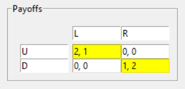

# interactive-gt
An interactive game theory application for analyzing 2-player games using nashpy and axelrod in a tkinter GUI. 

Equilibria for a Battle of the Sexes, and an axelrod match between a Tit for Tat player and an Alternator: 

Prompt that ensures the user wants to resize the payoff matrix, which clears the values: 

Equilibria for a three-by-three matrix with lots of strictly dominated strategies: 

Warning when computing the equilibria of a degenerate game:

Equilibria of a degenerate game: 
