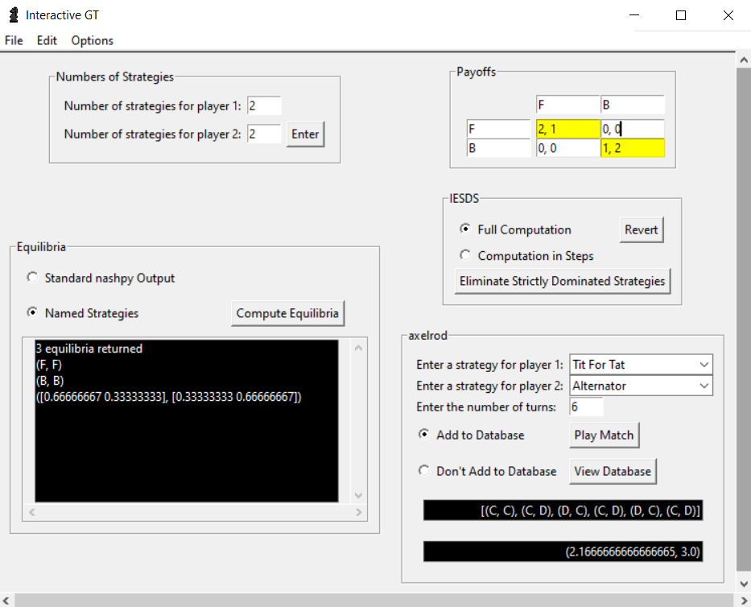
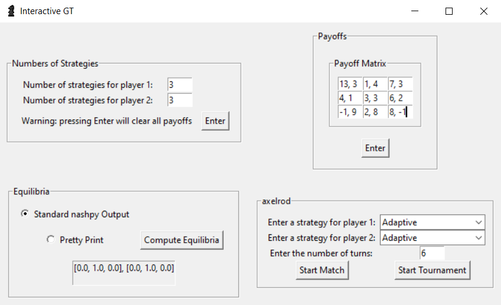
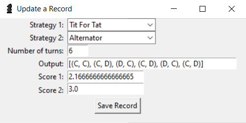

# interactive-gt
An interactive game theory application for analyzing 2-player games using nashpy and axelrod in a tkinter GUI. 

Highlighted equilibria for a Battle of the Sexes, and an axelrod match between a Tit for Tat player and an Alternator: \

An SQLite database of matches with a match for every pair of strategies with 1 turn entered in: \

The Update Record window: \

The Search Records window: \

## Explanation of the First Image
Suppose that there's a wife and her husband who are in two separate places and can't talk to each other. The wife prefers to go to a ballet ($B$), and the husband prefers to go to a fight (F). They must both choose an event and go there. Suppose also that the husband receives \$2 if he meets his wife at the fight (because he prefers it) and the wife receives \$1 if she meets her husband at the fight. On the other hand, the husband receives \$1 if he meets his wife at the ballet, and the wife receives \$2 if she meets her husband at the ballet (because she prefers it). If they choose to go to different places, they're sad and both receive \$0.

This game is a game of coordination because they have to try to choose the same place, and we call it a _Battle of the Sexes_. We can call it $G$ and represent it with the following payoff matrix: 

|       |      | Wife |       |
|-------|------|-------|------|
|       |      |  F   |   B   |
|Husband| F    | 2, 1  | 0, 0 |
|       | B    | 0, 0  | 1, 2 |

<!-- $
    \begin{array}{|cc||c|c|}
        \hline
        G & & Wife & \\
        & & F & B \\ \hline\hline
        Husband & F & 2, 1 & 0, 0 \\ \hline
        & B & 0, 0 & 1, 2 \\ \hline
    \end{array}
$ -->

We call each pair $(F, F), (F, B), (B, F)$, and $(B, B)$ _outcomes_. We call the numbers associated with each player in each outcome _payoffs_. We call the options $F$ and $B$ _strategies_. 
### Best Responses
Now, suppose that the wife chooses $F$; ignore the scenario where she chooses $B$. 

|       |      | Wife |
|-------|------|-------|
|       |      |  F   |
|Husband| F    | <mark>2</mark>, 1  |
|       | B    | <mark>0</mark>, 0  |
<!-- $
    \begin{array}{|cc||c|}
        \hline
        & & Wife \\
        & & F \\ \hline\hline
        Husband & F & \colorbox{yellow}{2}, 1 \\ \hline
        & B & \colorbox{yellow}{0}, 0\\ \hline
    \end{array}
$ -->

Here, we see that the husband is choosing between 2 and 0. Obviously, he'll choose 2 because $2 > 0$, so we mark it:

|       |      | Wife |       |
|-------|------|-------|------|
|       |      |  F   |   B   |
|Husband| F    | (2), 1  | 0, 0 |
|       | B    | 0, 0  | 1, 2 |
<!-- $
    \begin{array}{|cc||c|c|}
        \hline
        G & & Wife & \\
        & & F & B \\ \hline\hline
        Husband & F & (2), 1 & 0, 0 \\ \hline
        & B & 0, 0 & 1, 2 \\ \hline
    \end{array}
$ -->

We call this a _best response_, and we see that the husband also has a best response when the wife chooses $B$. That is, $1 > 0$: 

|       |      | Wife |       |
|-------|------|-------|------|
|       |      |    |   B   |
|Husband| F    |   | 0, 0 |
|       | B    |   | 1, 2 |

<!-- $
    \begin{array}{|cc||c|c|}
        \hline
        & & Wife & \\
        & & & B \\ \hline\hline
        Husband & F & & \colorbox{yellow}{0}, 0 \\ \hline
        & B & & \colorbox{yellow}{1}, 2 \\ \hline
    \end{array}. 
$ -->

Therefore, we have all the best responses of the husband: 

|       |      | Wife |       |
|-------|------|-------|------|
|       |      |  F   |   B   |
|Husband| F    | (2), 1  | 0, 0 |
|       | B    | 0, 0  | (1), 2 |
<!-- $
    \begin{array}{|cc||c|c|}
        \hline
        G & & Wife & \\
        & & F & B \\ \hline\hline
        Husband & F & (2), 1 & 0, 0 \\ \hline
        & B & 0, 0 & (1), 2 \\ \hline
    \end{array}. 
$ -->

We do exactly the same thing for the best responses of the wife. Again, $1 > 0$: 

|       |      | Wife |       |
|-------|------|-------|------|
|       |      |  F   |   B   |
|Husband| F    | 2, 1  | 0, 0 |
<!-- $
    \begin{array}{|cc||c|c|}
        \hline
        & & Wife & \\
        & & F & B \\ \hline\hline
        Husband & F & 2, \colorbox{yellow}{1} & 0, \colorbox{yellow}{0} \\ \hline
    \end{array}, 
$ -->

and $2 > 0$: 

|       |      | Wife |       |
|-------|------|-------|------|
|       |      |  F   |   B   |
|Husband| F    |   |  |
|       | B    | 0, 0  | 1, 2 |
<!-- $
    \begin{array}{|cc||c|c|}
        \hline
        & & Wife & \\
        & & F & B \\ \hline\hline
        Husband & &  &  \\ \hline
        & B & 0, \colorbox{yellow}{0} & 1, \colorbox{yellow}{2} \\ \hline
    \end{array}. 
$ -->

We then have all the best responses

|       |      | Wife |       |
|-------|------|-------|------|
|       |      |  F   |   B   |
|Husband| F    | (2), (1)  | 0, 0 |
|       | B    | 0, 0  | (1), (2) |
<!-- $
    \begin{array}{|cc||c|c|}
        \hline
        G & & Wife & \\
        & & F & B \\ \hline\hline
        Husband & F & (2), (1) & 0, 0 \\ \hline
        & B & 0, 0 & (1), (2) \\ \hline
    \end{array}
$ -->

### Pure Equilibria
Note that in the game $G$, every payoff in outcomes $(F, F)$ and $(B, B)$ is marked as a best response. Also, note that this game now looks like the matrix in the first photo (image1.png) above: 

|       |      | Wife |       |
|-------|------|-------|------|
|       |      |  F   |   B   |
|Husband| F    | (2), (1)  | 0, 0 |
|       | B    | 0, 0  | (1), (2) |
<!-- $
    \begin{array}{|cc||c|c|}
        \hline
        G & & Wife & \\
        & & F & B \\ \hline\hline
        Husband & F & \colorbox{yellow}{(2), (1)} & 0, 0 \\ \hline
        & B & 0, 0 & \colorbox{yellow}{(1), (2)} \\ \hline
    \end{array}
$ -->

When every payoff in an outcome is a best response like this, we call that outcome a pure _equilibrium_. The main thing to remember about equilibria is that when players (the husband and wife, for example) are playing an equilibrium, no player has an incentive to deviate to a different strategy. In outcome $(F, F)$ the husband wouldn't want to switch from getting 2 to getting 0 because $2 > 0$, and the wife wouldn't want to switch from getting 1 to getting 0 because $1 > 0$, for example, so they have no incentive to deviate from $(F, F)$, nor from $(B, B)$. 

# Installation
Currently, this application may only be installed by downloading `interactivegt.py` and running it. 